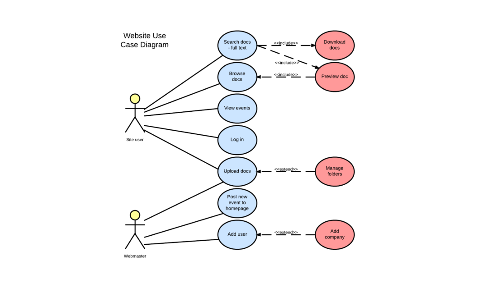
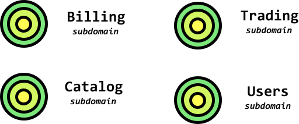
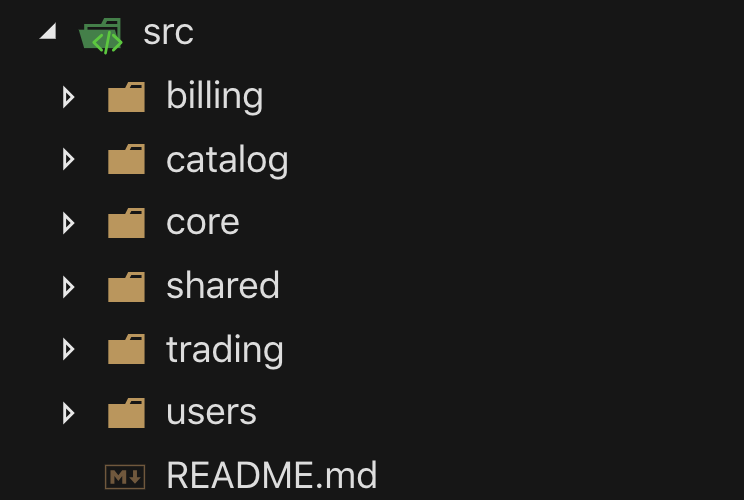
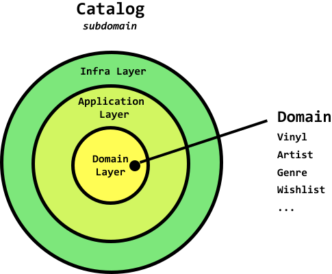
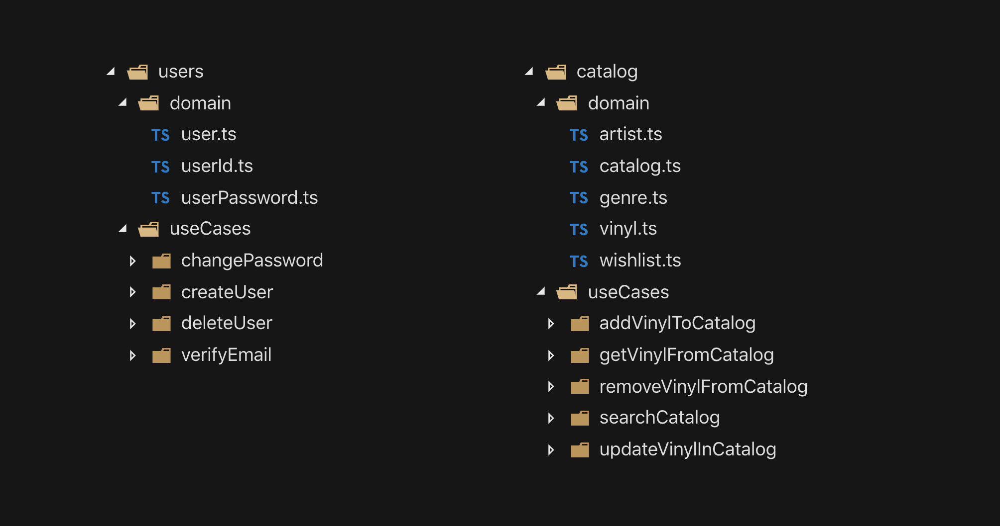
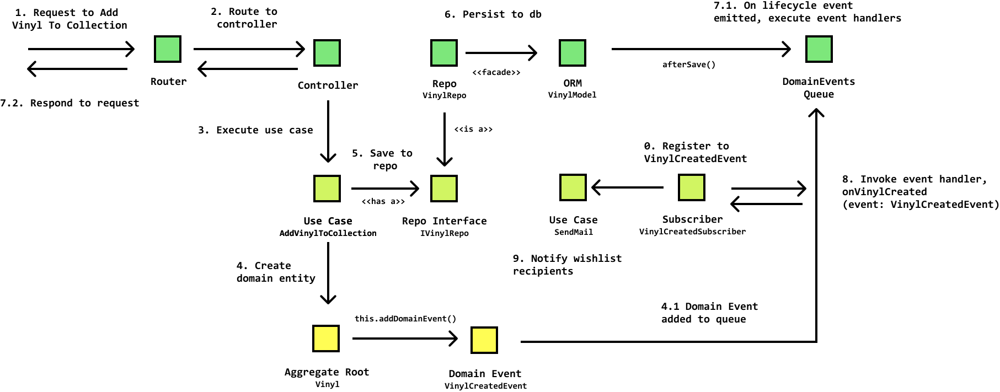

> 原文地址：[application-layer-use-cases](https://khalilstemmler.com/articles/enterprise-typescript-nodejs/application-layer-use-cases/)
# 用应用层用例来做更好的软件设计 | 企业级Node.js+Typescript
> 在这篇文章中，我们探索如何组织应用层的应用逻辑用例来帮助实现定位原因更简单的大型typescript项目

用例一般用于保证我们的软件能在多种条件下都可以正常使用

有另一种说法是有时候，过去才是未来，即使概念是几乎相同的

构建软件的目的就是来追踪一个或者更多个用例

在大型项目中，有时候很难去判定这些系统的能力

“CRUD apps designed API-first”（先野蛮实现app）成了一个难以置信的正确的理论

但是如果在我们的代码里出现了一个流行的结构能够描述好app内所有的不同的能力呢？

有时候那能帮我们做出更好的封装、组织并能持续追踪我们应用出现的所有的情况。

这真的存在，你可能已经猜到了，它被叫做：用例

——————————————————————————————————————————————————————————————————

在整洁的结构这篇文章里有提到，用例是对一个封装基础的业务逻辑执行我们的应用内的特性的应用层

在这篇文章，我们会继续发掘以下的课题，使用用例Node.js/Typescript应用

- 怎么发现用例
- 应用层的角色
- 怎么定义子用例的归属
- 用例是如何让大型项目有更多的可读性的（令人尖叫的结构）
- 如何用typescript实现用例

代码见：[white-label](https://github.com/stemmlerjs/white-label)

## 发现用例

有很多不同的方式来设计构建一个应用。很长一段时间里，当我准备构建点儿什么东西的时候，我都都很简单的就先做出来api设计

再后来，我又倾向于网站的结构设计并从接口层面开始，因为前端经常主宰什么东西真的需要和[YAGNI](https://khalilstemmler.com/wiki/yagni/)
(注：YAGNI是一个法则，不多写任何一个没用的方法)

不久之后我开始做非常复杂的项目的时候我意识到我真的需要用一个更加传统的方式来做软件设计：用例设计

### 传统的方式

有个很传统的方式来定义和设计用例, 使用用例程序

在用例程序里，绑定的小人代表着我们系统的主角（谁在使用），然后圆形代表着所有的实际的我们这个软件里准备使用的用例



我觉得这是一个很行的方式告诉我们是怎么创造的这些东西，但是在开始设计的系统的时候我却很少为他们生成单独的文档

于是我尝试去鉴定这些必要的组件通过对话的方式，然后用一种自由表格的方法把他们画出来

### 基础用例

最重要的是理解认证的用例是什么：

1. 系统的主角是谁（谁在执行这些用例）
2. 这些用例既不是命令也不是队列
3. 这些用例属于一个特殊的子域，可以按照不相关的的上下文进行开发

#### 1. 主角

它可以被叫做主角或者用户，我们能这么做，但是他自己并没有对自己的领域说太多东西（我们对他可能一无所知）

我们有时候管他叫做用户，就像是一个认证和管理系统的权限就像Amazon IAM和Auth0，但是我们应该尽可能更积极的以我们所能鉴定真正的系统的主角来思考这个域名的角色们

一下是一些对于主角的选项：

- 财务系统： 顾客，订购人，会计，出纳员，雇员
- 博客系统： 编辑者，审核者，游客，作者
- 招聘平台： 求职者，雇员，面试者，HR
- 我们的唱片商业项目：商人，管理员
- 一个电子邮件公司：联系人，收件人，发件人，管理员

你Get到了吗？角色关系。

#### 2. 用例是命令与查询

一个用例可能会既不是命令也不是查询

举个例子，在我们的唱片商业app里面，“白名单”， 是一个特别的命令来添加唱片到我们的希望列表里。这在我们的代码里的类名叫做AddVinylToWishlist

查询的例子就是GetWishlist, 意思就是我要获取我们的希望列表

#### 3. 用例属于一个特别的子域

通常来讲，大部分应用是由部分子域构成的。

如果你记不住什么是域模型设计的子域的话，它是一整个域的一个合理的分割。

> 子域是困难的域空间的一个合理的分割

什么是困难的域呢？

举个例子， 在我正在构建与设计的唱片贸易app里面的话，就是交易唱片。

但是困难的域不是只有这个功能，这里有太多我们需要去关联的东西了

做这个交易系统，这个企业需要去记录一些其他的子域，进入和权限管理（Uers）， 商品目录（Catalog），财务（billing），提醒和其他的更多的子域。



这就是康威定律的本质：

> 任何设计系统的组织，必然会产生以下设计结果：即其结构就是该组织沟通结构的写照。简单来说： 产品必然是其组织沟通结构的缩影。

康威定律实际上帮助我们回答了很多问题就像以下这些：

- 我们怎么决定如何划分我们的子域？
- 我们怎么决定一个用例属于哪个子域？
- 我们如何让这些用例在未来更加好用？

想要探寻康威定律如何帮助解决这些问题的话，请参照[这篇文章](https://khalilstemmler.com/wiki/conways-law/)

在任何一个域驱动项目中，我们通常会分解整个问题域为一些子域，又有一些是我们开发过程中必不可少的（就像交易子域和商品目录子域），还有一些是我们可能会使用一个中间商（就像Auth0之于用户和认证系统或者条纹之于财务）

大型的史诗级别应用都在划分子域上面有一些小小的相似之处就是都是逻辑分离



> 一个伟大的开始和一个缩略的规定是保证史诗级项目的子域用目录来互相独立。这能提升项目的可读性

如果我们虚构的企业应用需要拓展，那么逻辑分离会相当适合我们来通过物理分离我们的问题域成为一些独立的可开发的单元。

换句话说： 微服务。

在域驱动开发的话术叫做：边界上下文分离

> 开发者可以应用领域驱动设计（DDD）中的 Bounded Context 概念将一个大模型分解为几个较小的模型，每一个模型对应Entity Framework（EF）中的 Database Context（DbContext 类）。  

### 我们发现用例通过会话

关于软件开发的一个巨大的无解是开发者只需要在角落里开发代码不需要和其他人说话。

这是相当的不正确。这么多软件开发（尤其是DDD 域驱动开发）是始终尝试去确定正确的语言来更有效率的创建一个稳定的软件模型生命周期的执行。

————————————————————————————————————————————————————————————————————

这是一个在white label内发现的一些用例的对话的例子

> 那么，我对这个app有个新想法，这是一个你再任何地方都能与其他人狡猾唱片的app

“是的，酷。这像是什么？Discogs？”

“是的，非常正确，但是这仅是适用于唱片。非常时髦。”

“非常棒，我喜欢。如果我不想要教育我的唱片了呢？我能不能只是买点儿什么？”

“好，我们说：你可以交易你自己的唱片给别人，你也可以交易给他们钱”

“哦，那这样怎么样？用户可以做很复杂的订单，就像我给你两个Devo的专辑，一个Sex Pistols专辑和60美元来交换那个限定款生日派对唱片”

“啊，所以这里有订单和交易。一个订单可以包括一些记录与/或者一些现金作为狡猾更多的记录。然后接受到这个订单的人既可以接收也可以拒绝这个订单。”

“是得，那听起来相当正确。如果他们想要拒绝的话，他们可以在拒绝的同时发表一些评论， 告诉对方我为什么拒绝，然后给他们另外一个理由来做更好的订单。”

“是得，好，很棒。”

“所以现在我们发现了哪些用例呢？”

“
- MakeOffer(offer: Offer)
- DeclineOffer(offerId: OfferId, comments?: string)
- AcceptOffer(offerId: OfferId)
”

"也许我们也要拥有获取所有offer的能力，还有根据id获取offer的能力。我们也需要想想UI怎么做。这里需要一些用例。"

“是得，对。所以要加上**GetAllOffers(userId: User)**, **GetOfferById(offerId: OfferId)**”

“嗯，那么**User**从哪儿获取？”

“那是我们需要这么一大段时间来讨论的，不。这些事儿**Users**会做的。”

“好吧，但是这不完全对。我们想想[统一术语](https://www.google.com/search?q=ubiquitous+language&oq=ubiquitous+language&aqs=chrome..69i57.6981j0j7&sourceid=chrome&ie=UTF-8).对Trading子域和他们的角色保持尊重，我们需要叫他们**Traders**或者**RecordCollectors**”

“我知道，这个术语**User**或许更多属于**Users & Identity**子域， 不是在...**Trading**子域， 这是我们到现在为止讨论到的，对吗？”

“是的，这是正确的”

“好，我们接下来讨论**Traders**”

“非常好，到现在为止，在**Traders**子域里面，我们找到的用例有：

- MakeOffer(offer: Offer)
- DeclineOffer(offerId: OfferId, comments?: string)
- AcceptOffer(offerId: OfferId)
- GetAllOffers(traderId: TraderId)
- GetOfferById(offerId: offerId)

我想不到其他更多了现在。”

“我也想不到了，我们先这样吧。”

“那么现在看起来我们已经定义了一些入口了。**Offer**和**Trader**，对吗？”

“是的，**Offer**可以是一个总入口对于所有的**OfferItems**（一个钱和唱片的合集）。我们稍晚可以整理。到现在为止听起来很棒。”

“哦，那么既然我们提及了**Users & Identity**子域， 我们是不是也记录一下呢？”

“额，好 - 我们能够这样做。这可能对其他的app也是一样的。”

“你的意思是？”

“这些用例是通用的。他们正常情况下就像：

- login(userEmail: UserEmail, password: UserPassword)
- logout(authToken: JWTToken)
- verifyEmail(emailVerificationToken: EmailVerificationToken)
- changePassword(passwordResetToken: Token, password: UserPassword)

你现在明白了吗？你可能把这件事情做了很多次了。
”

“啊，你的意思是这块我们可以用别人的？”

“是的，我们或许可以试试[Auth0](https://auth0.com/)”

“我们在DDD模式里面叫他什么？这个子域的类型有点儿...”

“一个通用子域”

“啥意思？”

“意思就是这是很重要的一部分对于这件事，但不是核心部分。核心必然是**Trading**子域。”

“对的。那将会是核心子域，因为他们在我们的app里面是相当独特的事情。我们不能把这部分用通用或者拿通用的随便组装一下。”

### 应用层的角色

如果你一直跟随着[Enterprise Node.js + Typescript](https://khalilstemmler.com/articles/categories/enterprise-node-type-script/)的话，你会回看[Domain Layer](https://khalilstemmler.com/articles/enterprise-typescript-nodejs/clean-nodejs-architecture/)包括了大部分的[Entities（实例）](https://khalilstemmler.com/articles/typescript-domain-driven-design/entities/), [value objects（值对象）](https://khalilstemmler.com/articles/typescript-value-object/), 他们对其他的层是0依赖的， 也是第一个我们来定位商业逻辑的部分，特别是如果它属于一个特别的实例。

拿White Label来举例，如果我想要找出通常逻辑定位在哪儿的话，我们需要先确定一个**Vinyl**只能有最多三个不同的**Genre**，这货在**Vinyl**类里体现。（这是一个根）

```typescript

class Vinyl extends AggregateRoot<VinylProps> {
  ...

  addGenre (genre: Genre): Result<any> {
    if (this.props.genres.length >= MAX_NUMBER_OF_GENRES_PER_VINYL) {
      return Result.fail<any>('Max number of genres reached')
    } 

    if (!this.genreAlreadyExists(genre)) {
      this.props.genres.push(genre)
    }

    return Result.ok<any>();
  }
}

````

> 确定的完整的域模型通过这个模型自身的验证逻辑在内

**Vinyl**是其中**Catalog**子域的应用层内的众多域模型内的一个。



好，所以我们大概理解了应用层到底干什么的。现在我们回想一下基础架构层包含了一些外部服务和一些我们不想要混入我们的内部层的业务（controllers，databases，caches，etc）

所以，应用层的角色是什么？

> 应用层包括在我们应用里的一个特殊的子域的用例。

用例描述了应用的特性，他们可能是独立开发的，或者按照史诗项目开发的。

那意味着当我们把用例直接放入子域的时候，我们能马上理解那个子域的功能。

在域开发法则里，用例就是应用服务。除了执行某些域逻辑所需的信息之外，他们还负责检索域实例。

举例来说，在```AcceptOffer(offerId: OfferId)```用例里面，我所有需要的就是```OfferId```.这对我来说不够完成accept这个动作。我需要整个```offer```实例来保存```offer.accept()```然后执行一个```OfferAcceptedEvent```的域事件。为了得到```offer```, 我需要用一个仓库来取回和保存。这是他们如何用域实例来取回和旋转一个执行环境的。

我们来看看我们如何在这些实例下构造一个项目。

### 根据实例构造项目

Bob叔叔定义了一个模式叫做[Screaming Architecture(令人尖叫的架构)](https://www.google.com/search?q=screaming+architecture&oq=screaming+architecture&aqs=chrome..69i57.5406j0j7&sourceid=chrome&ie=UTF-8). 它的意思是通过看这个项目的架构， 他们应该是形象化的对于我们来说：我们正在做的项目类型，还有这个系统包含什么功能。

这是一点点这个white label看起来像什么的东西当我们把它分割为**子域 => 用例 + 实例**



我们大概看一眼可以知道User子域和catelog子域里面都包含什么和他们要做什么。


### 一个用例接口

用例用法则来实现很简单。他们有可选的请求和回应。

```typescript

export interface UseCase<IRequest, IResponse> {
  execute (request?: IRequest) : Promise<IResponse> | IResponse;
}

````

执行设计法则“总是面向接口编程，不要上来就实现它”，我们可以创建代表这个用例的一些接口就像这样。

很简单对不对？

### 实现一个用例

我们看看我们怎么实现，我们先做一下catelog子域内的```AddVinylToCatalogUseCase```吧

首先，我们会创建这个类，然后实现这个接口，用any模式作为通用DTO（data transmission objects）

```typescript
export class AddVinylToCatalogUseCase implements UseCase<any, any> {
  public async execute (request: any): Promise<any> {
    return null;
  }
}
```

是的，所以为了更新```Vinyl```，我们需要提供所有必要的银子，也需要```Trader```的id。

我们把所有的放进请求DTO把。

```typescript
interface AddVinylToCatalogUseCaseRequestDTO {
  vinylName: string;
  artistNameOrId: string;
  traderId: string;
  genresArray?: string | string[];
}

export class AddVinylToCatalogUseCase 
  implements UseCase<AddVinylToCatalogUseCaseRequestDTO, any> {
    
  async execute (request: AddVinylToCatalogUseCaseRequestDTO) : Promise<any> {
    return null;
  }
}
```

我们已经事实上开发了这个用例了。

现在我们的```Vinyl```母类需要一个```Artist```实例，我们需要定义需要返回artist的id还是artistName.

如果请求跪了，我们需要使用结果类来安全的返回或者报错，如果没有的话我们会使用一个```VinylRepo```来保存```Vinyl```。

所以我们现在需要用依赖注入来注入一个VinylRepo和一个ArtistRepo.

我们可以总结出来它作为类的构造依赖。

```typescript
interface AddVinylToCatalogUseCaseRequestDTO {
  vinylName: string;
  artistNameOrId: string;
  traderId: string;
  genresArray?: string | string[];
}

export class AddVinylToCatalogUseCase 
  implements UseCase<AddVinylToCatalogUseCaseRequestDTO, Result<Vinyl>> {

  private vinylRepo: IVinylRepo;
  private artistRepo: IArtistRepo;

  constructor (vinylRepo: IVinylRepo, artistRepo: IArtistRepo) {
    this.vinylRepo = vinylRepo;
    this.artistRepo = artistRepo;
  }

  public async execute (request: AddVinylToCatalogUseCaseRequestDTO): Promise<Result<Vinyl>> {
    return null;
  }
}
```

现在我们再来看看逻辑吧

```typescript
export interface AddVinylToCatalogUseCaseRequestDTO {
  vinylName: string;
  artistNameOrId: string;
  traderId: string;
  genresArray?: string | string[];
}

export class AddVinylToCatalogUseCase 
  implements UseCase<AddVinylToCatalogUseCaseRequestDTO, Result<Vinyl>> {

  private vinylRepo: IVinylRepo;
  private artistRepo: IArtistRepo;

  constructor (vinylRepo: IVinylRepo, artistRepo: IArtistRepo) {
    this.vinylRepo = vinylRepo;
    this.artistRepo = artistRepo;
  }

  public async execute (request: AddVinylToCatalogUseCaseRequestDTO): Promise<Result<Vinyl>> {
    const { vinylName, artistNameOrId, traderId, genresArray } = request;
    let artist: Artist;

    const isArtistId = TextUtil.isUUID(artistNameOrId);

    if (isArtistId) {
      artist = await this.artistRepo.findById(artistNameOrId);
    } else {
      artist = await this.artistRepo.findByArtistName(artistNameOrId);
    }

    if (!!artist) {
      artist = Artist.create({ 
        name: ArtistName.create(artistNameOrId).getValue(), genres: [] 
      }).getValue();
    }

    const vinylOrError = Vinyl.create({
      title: vinylName,
      artist: artist,
      traderId: TraderId.create(new UniqueEntityID(traderId)),
      genres: []
    });

    if (vinylOrError.isFailure) {
      return Result.fail<Vinyl>(vinylOrError.error)
    } 

    const vinyl = vinylOrError.getValue()

    await this.vinylRepo.save(vinyl);
    return Result.ok<Vinyl>(vinyl)
  }
}
```

大功告成！现在这个应用看起来怎么样？

### 用例与基础设施层也相关

用例怎么实现都是有可能的。

我们可以提供输入，它们可以执行命令和查询在我们的系统上。

那意味着他们可以挂载在express.js 的controllers或者其他的基础设施层的外部服务上。

```typescript
import { BaseController } from "../../../../../infra/http/BaseController";
import { AddVinylToCatalogUseCase } from "./CreateJobUseCase";
import { DecodedExpressRequest } from "../../../../../domain/types";
import { AddVinylToCatalogUseCaseRequestDTO } from "./AddVinylToCatalogUseCaseRequestDTO";

export class AddVinylToCatalogUseCaseController extends BaseController {
  private useCase: AddVinylToCatalogUseCase; 

  public constructor (useCase: AddVinylToCatalogUseCase) {
    super();
    this.useCase = useCase;
  }

  public async executeImpl (): Promise<any> {
    const req = this.req as DecodedExpressRequest;
    const { traderId } = req.decoded;
    const requestDetails = req.body as AddVinylToCatalogUseCaseRequestDTO;
    const resultOrError = await this.useCase.execute({
      ...requestDetails,
      traderId
    });
    if (resultOrError.isSuccess) {
      return this.ok(this.res, resultOrError.getValue());
    } else {
      return this.fail(resultOrError.error);
    }
  }
}
```

用例本身也可以被其他应用层的用例执行（但是根据Bob叔叔的依赖法则来说不能从域层执行）。这些真的太酷了。

### 优雅的使用用例和域事件

事实上有一个非常优雅的方式来连接用例。

你会想把用例们连接在一起当一个事件可能切换另一个用例被执行在特定的场景里。在DDD（域驱动设计）里，我们已经定义了这特个行为通过[Event storming exercise](https://philippe.bourgau.net/how-to-use-event-storming-to-introduce-domain-driven-design/)然后使用观察者模式来发送域事件。

### 提醒交易者当一个项目被添加到心愿名单里

在white label项目内，交易者可以添加艺人或者特殊的唱片到他们的心愿名单里面。如果有人加了一个新的产品到他们的集合里面，对这个特殊的唱片或者艺人感兴趣的交易者们会被提醒它已经发送了。通过这种方式，他们可以为了他们感兴趣的唱片向拥有者发起一个offer。

接下来的这张图解是一个简单的层和用例之间联系的图示。



在此基础上，如果我们想要在史诗里开发我们的子域以微服务替代运行时在一个独立的进程的话，我们可以利用信息破坏者例如[Rabbit MQ](https://www.rabbitmq.com/)或是[Amazon MQ](https://aws.amazon.com/cn/amazon-mq/)

我们会花费尽量少的笔墨来未来的文章里使用观察者模式用一些低耦合的方式来挂载域事件来执行连接好的用例。

### 源码

这篇文章里的代码是从White Label，一个使用DDD模式、用Node.js与Typescript来构建的唱片交易企业级应用。你可以在Github上看[这些代码]
[https://github.com/stemmlerjs/white-label](https://github.com/stemmlerjs/white-label)


